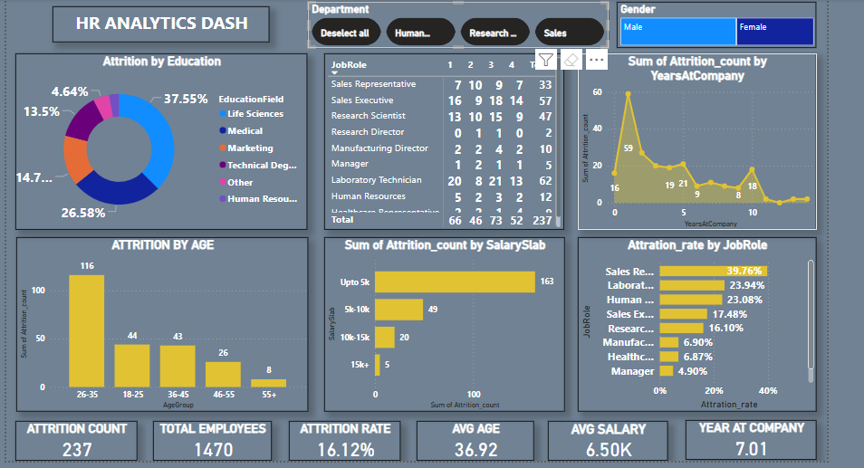

# PWC-Switzerland-Power-Bi-HR-Analytics
# 📊 HR Analytics Dashboard – Power BI Project

This Power BI dashboard analyzes employee attrition across multiple dimensions to help HR identify key trends and problem areas in the organization.

---

## 👥 Overview

- **Total Employees Analyzed**: 1,470  
- **Attrition Count**: 237  
- **Attrition Rate**: 16.12%  
- **Average Age**: 36.92 years  
- **Average Salary**: ₹6.5K  
- **Average Tenure**: 7.01 years  

---

## 🔍 Key Attrition Insights

### ✅ By Age Group:
- Highest attrition in the **26–35** age group (116 employees)
- Noticeable attrition in the 18–25 and 36–45 groups

### ✅ By Education Field:
- Top fields: **Life Sciences (37.55%)**, **Technical Degree (26.58%)**
- Lowest attrition from **Medical** and **Marketing** backgrounds

### ✅ By Salary Slab:
- Most attrition occurs in the **under ₹5K** salary group (163 employees)
- Very low attrition in higher salary brackets

### ✅ By Job Role:
- Highest attrition in:
  - **Sales Representatives**: 39.76%
  - **Lab Technicians**: 23.94%
  - **Human Resources**: 23.08%
- Lowest attrition among **Managers** and **Healthcare Reps**

### ✅ By Years at Company:
- Sharpest attrition (59 cases) occurs in the **first year**
- Steady decline in attrition after 3+ years

---

## 🧠 Business Recommendations

- Strengthen onboarding and engagement programs to reduce **first-year attrition**
- Focus retention strategy on **younger, lower-paid employees**
- Revisit pay structure for high-risk roles like **Sales** and **Lab Technicians**

